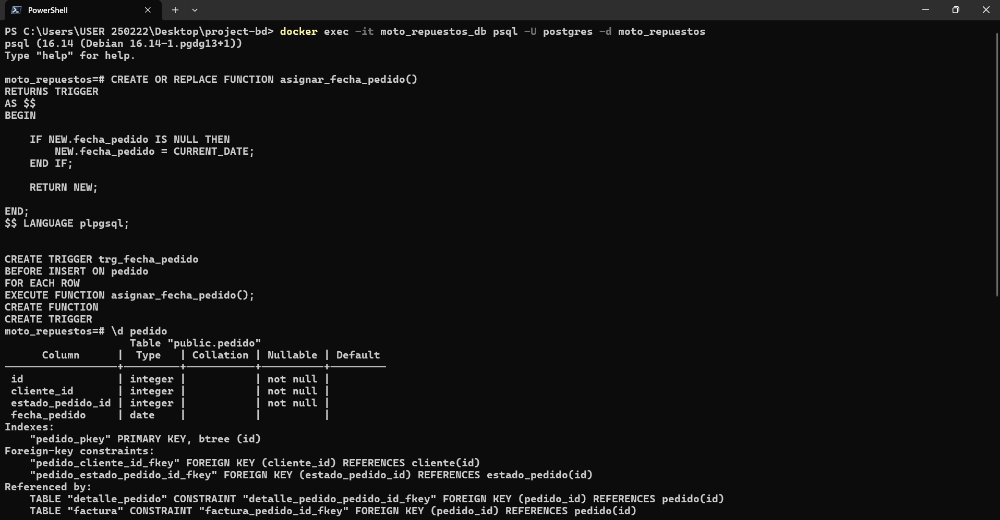
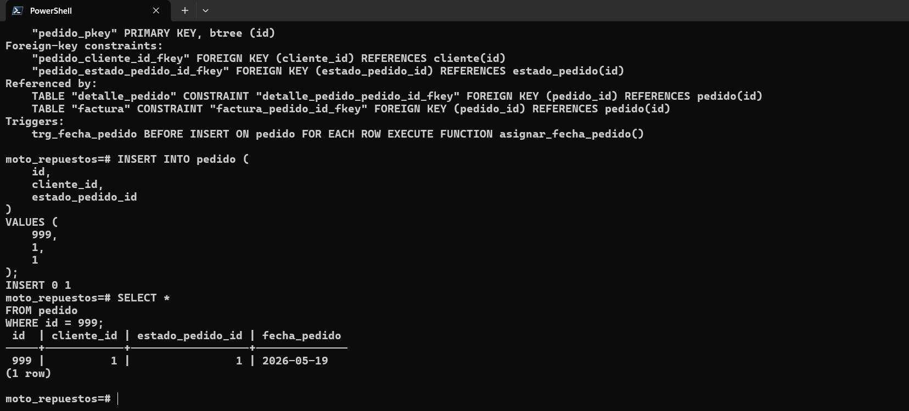
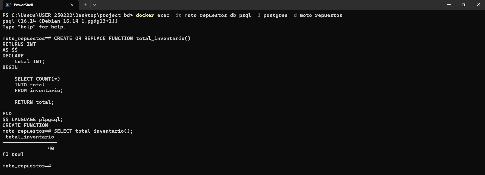
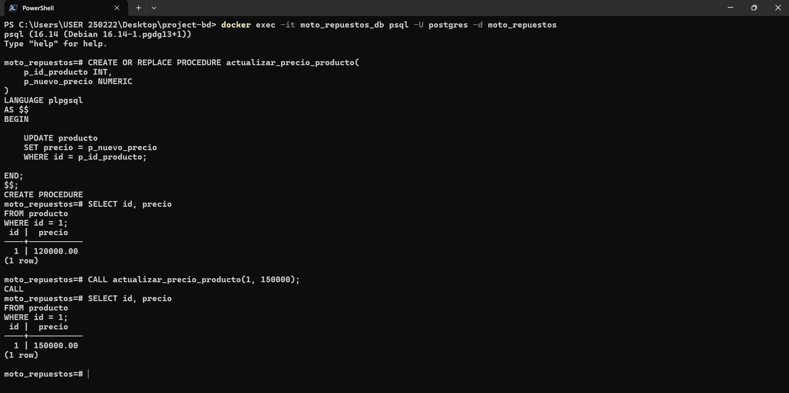
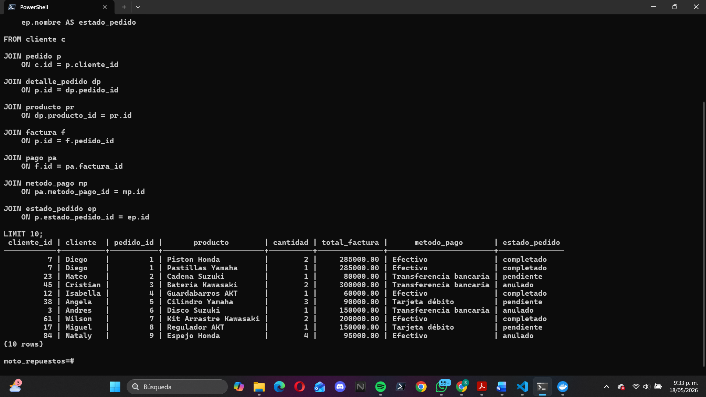
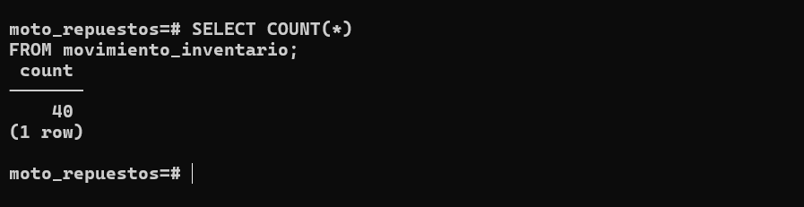

# Evidencia Trigger - Fecha Automática Pedido

## Integrante responsable

# Santiago Manrique Gonzalez

## Archivo donde se implementó

scripts/triggers/trigger_fecha_pedido.sql

## Descripción

Este trigger asigna automáticamente la fecha actual a un pedido cuando se inserta un registro sin fecha.

## Código de prueba

```sql
INSERT INTO pedido (
    id,
    cliente_id,
    estado_pedido_id
)
VALUES (
    999,
    1,
    1
);
```

```sql
SELECT *
FROM pedido
WHERE id = 999;
```

## Resultado esperado

El sistema debe asignar automáticamente la fecha actual al pedido.

Ejemplo:

fecha_pedido = CURRENT_DATE

## Evidencia de ejecución




# Function - Total inventario

## Archivo donde se implementó

scripts/functions/function_total_inventario.sql

## Descripción

Esta función cuenta cuántos registros hay en la tabla inventario.

## Código de prueba

```sql
SELECT total_inventario();
```

## Resultado esperado

La función debe mostrar la cantidad total de registros en inventario.

Ejemplo:

40

## Evidencia de ejecución



# Procedure - Actualizar precio producto

## Archivo donde se implementó

scripts/procedures/procedure_actualizar_precio.sql

## Descripción

Este procedure permite actualizar el precio de un producto mediante su identificador.

## Código de prueba

```sql
CALL actualizar_precio_producto(1, 150000);
```

```sql
SELECT id, precio
FROM producto
WHERE id = 1;
```

## Resultado esperado

El precio del producto debe actualizarse correctamente.

Ejemplo:

120000 → 150000

## Evidencia de ejecución



# Consulta JOIN de más de 5 tablas

## Archivo donde se implementó

scripts/joins/join_reporte_cliente.sql

## Descripción

Consulta SQL que permite visualizar información de compras realizadas por clientes, incluyendo producto, cantidad, factura, método de pago y estado del pedido.

## Código de prueba

```sql
SELECT
    c.id AS cliente_id,
    c.nombre AS cliente,
    p.id AS pedido_id,
    pr.nombre AS producto,
    dp.cantidad,
    f.total AS total_factura,
    mp.nombre AS metodo_pago,
    ep.nombre AS estado_pedido
FROM cliente c
JOIN pedido p
    ON c.id = p.cliente_id
JOIN detalle_pedido dp
    ON p.id = dp.pedido_id
JOIN producto pr
    ON dp.producto_id = pr.id
JOIN factura f
    ON p.id = f.pedido_id
JOIN pago pa
    ON f.id = pa.factura_id
JOIN metodo_pago mp
    ON pa.metodo_pago_id = mp.id
JOIN estado_pedido ep
    ON p.estado_pedido_id = ep.id
LIMIT 10;
```

## Resultado esperado

La consulta debe mostrar información de clientes, pedidos, productos, pagos y estado del pedido.

## Evidencia de ejecución



# Aporte DDL/DML versionado

## Archivo donde se implementó

liquibase/dml/volumetric/008-movimiento_inventario.sql

## Descripción

Se realizó un aporte DML versionado en Liquibase para insertar datos en la tabla movimiento_inventario.

## Código de prueba

```bash
docker compose run --rm liquibase --defaultsFile=liquibase.properties validate
```

```bash
docker compose run --rm liquibase --defaultsFile=liquibase.properties update
```

```sql
SELECT COUNT(*)
FROM movimiento_inventario;
```

## Resultado esperado

Liquibase debe ejecutar correctamente las migraciones y registrar los datos en la tabla movimiento_inventario.

Ejemplo:

40 registros insertados.

## Evidencia de ejecución

